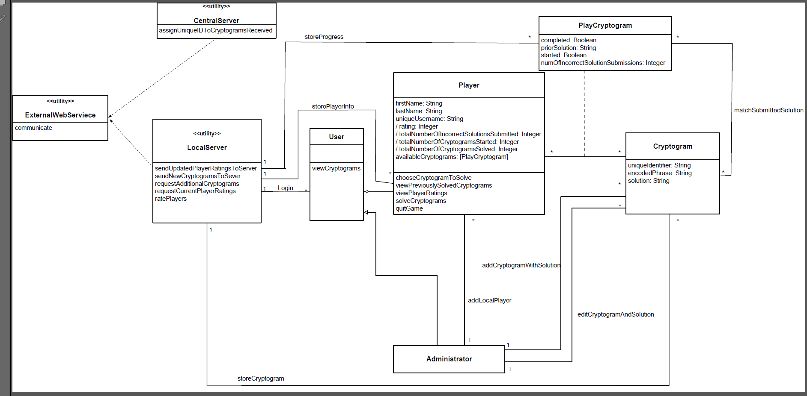

# Individual Designs

## Design 1 (xliang70)

There are several good aspects in this design.

The UML diagram is very simple and concise capturing the requirements in detail. It shows the relationships between the entities as specified by the requirements in a detailed manner. Every attribute that has been mentioned in the requirement has been added at the appropriate entity, so that the solution can be implemented without any gaps.

Here are some of the improvements that can be made:

Classes can be created in a hierarchical manner if it can be abstracted out into a common class. Distinct classes can be used for User, player and administrator. A cryptogram can be solved by all players, and this data needs to be captured for every player. Association classes has to be used to capture this data.

Even though, there are minor enhancements that can be made, this is a very good design.

## Design 2 (lfan42)

**Pros:**
On the whole, it is a very straightforward and precise design. It covers almost every requirement(attribute and operation) from the instructions. The relationships between classes make good sense. The quantitative relations between classes are also described clearly.

**Cons:**
There are also some improvements can be made. First, Duplicate *ExternalWebService* can be reduced to one instance. Secondly, an extra utility class *CentralServer* can be used to assign identifiers to cryptograms, keeping the responsibility of *ExternalWebService* simple. Likewise, a *LocalServer* can be store local data and used for user rankings calculation. Besides, similar to the Library System in lecture video, *PlayerCryptogram* can be an association class.

## Design 3 (ychai37)

**Pros:**

It is a great design which shows almost all the requirements of the game clearly and precisely. The most brilliant part is that the `OperatingSystemWithStorage` and the `CentralServer` utilities are added to fully present the working flows between the local game and the center server. Together with the `ExternalWebService`, the processes of both the adding/request of cryptograms and the update/request of player ratings are clearly illustrated.

**Cons:**
First the player rating list should be sorted by the `totalNumberOfCryptogramsSolved` attribute per the requirements, not the `rating` attribute. The latter is a derived attribute, however the designer didn't explain how it is derived from other attributes. Second a list of `PlayerCryptogram` instances should be added as an attribute of the player.

## Design 4 (bkothandam3)

**Pros:**
The strtucture of this UML diagram is clear and you can understand each part quickly and easily. It covers all the required section and their relationships. Since its elegant and concise structure, it can be implemented painless and straightforward by the developers.

**Cons:**
The first thing should be point out is the class *ExternalWebService* cannot be isolated with other classes. Some relationship between this class and others should be marked and detailed in the UML. Secondly, some methods should be detailed, such as *choose a cryptogram to solve*, *see previously solved cryptograms*, and *view the list of player ratings*

# Team Design

The four individual designs share the most key classes (`Administrator`, `Player`, and `Cryptogram`), relations (add palyer/cryptogram, solve cryptogram, and so on), and the external utility. Some individual designs may lack a few features, which is explained in details one by one in the following four paragraphs.

With few revisions made on ychai37's design, we now have our team design shown above. It presents all the requirements. The revisons made is talked and explained in the paragraph of _Design 3 (ychai37)_.

## Design 1 (xliang70)

The difference between team design and design 1 is although design 1 includes all the requirement parts, the classes could be created in a more clear way. If then, the developer can understand the whole design more easily. If more details could be marked in the UML such as some relationships between the classes should be better.

## Design 2 (lfan42)

Compared with th design 2, most classes are relations are the same. There are three main differences. First the player ratings class are now moved to be attributes of players. It's not necessary to add a class for it. At the same time the list of player rating is also removed, as it can be derived from attributes of players now. Second the list of `PlayerCryptogram` is also removed, as it can be obtained from information of game progresses of players. Third, a local server and a central server are added to show the working flow more clearly.

## Design 3 (ychai37)

Team Design is very similar to this individual one, but clearer. *OperatingSystemWithStorage* is renamed to *LocalServer*, to better clarify its purpose. For the *Player* class, attribute `previouslySolvedCryptograms: Cryptogram` is replaced by `availableCryptograms: [PlayCryptogram]`, which improved the understandability and decoupling.

## Design 4 (bkothandam3)

When we compare the team design with design 4, you will notice that the *ExternalWebService* that was isolated and standalone has been linked with the rest of the classes to show how it fits into the overall picture. The methods that need to be implemented in the classes has been added. This was a straight forward decision to ensure that the design is complete in all respects. The cardinality of the associations were also added to resolve ambiguity.

# Summary

The team members were chosen at random from different time-zones around the globe. The team was agile in coming up with a time that worked for everyone and was able to collaborate on the final design. After discussing the pros and cons of every design, we pulled the best of each and assembled them together to form the team design.

By critiquing each other design, we were able to learn on the defects in our design. By working and brainstorming together and revisiting the examples, we were able to learn several aspects like:
- a. understand the way the association class can be used.
- b. how to apply the derived member variables appropriately.
- c. appropriate usage of the utility classes.

After making the decision about the most suitable UML we would choose for our future team project, we went through all the requirements again and discussed more design details. We discussed how to improve the structure of the UML not only for meeting the requirement expectations, also for the future successful implementation.

All the members were able to contribute and learn from others. Overall, it was a good learning experience, setting up the stage to work on the future deliverables that will be assigned.
