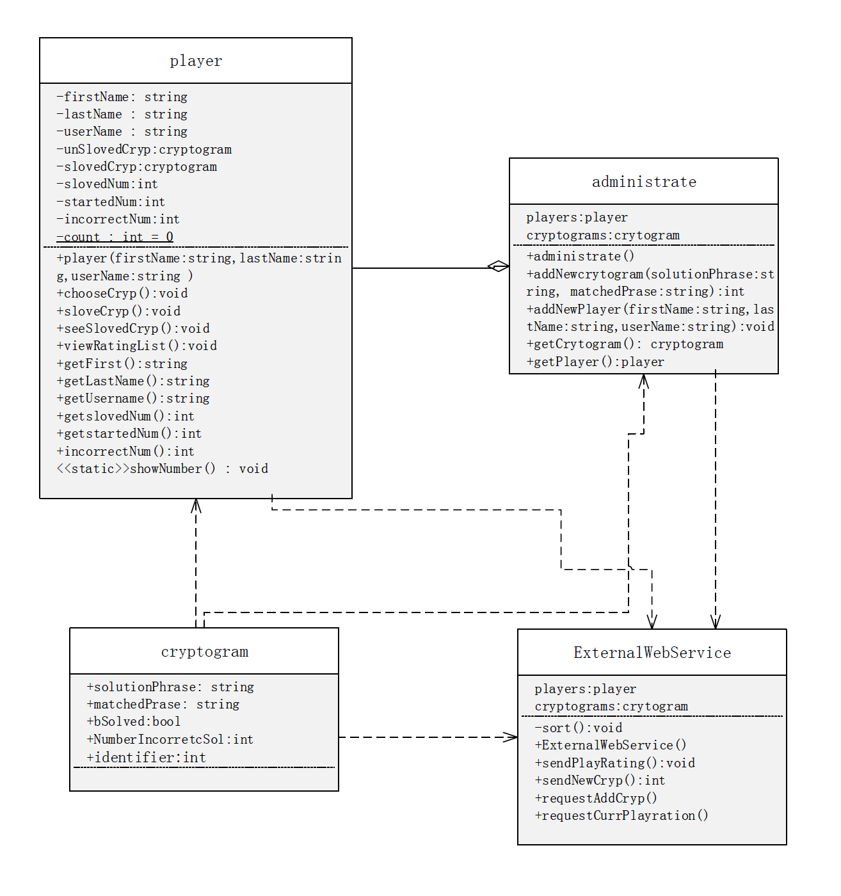
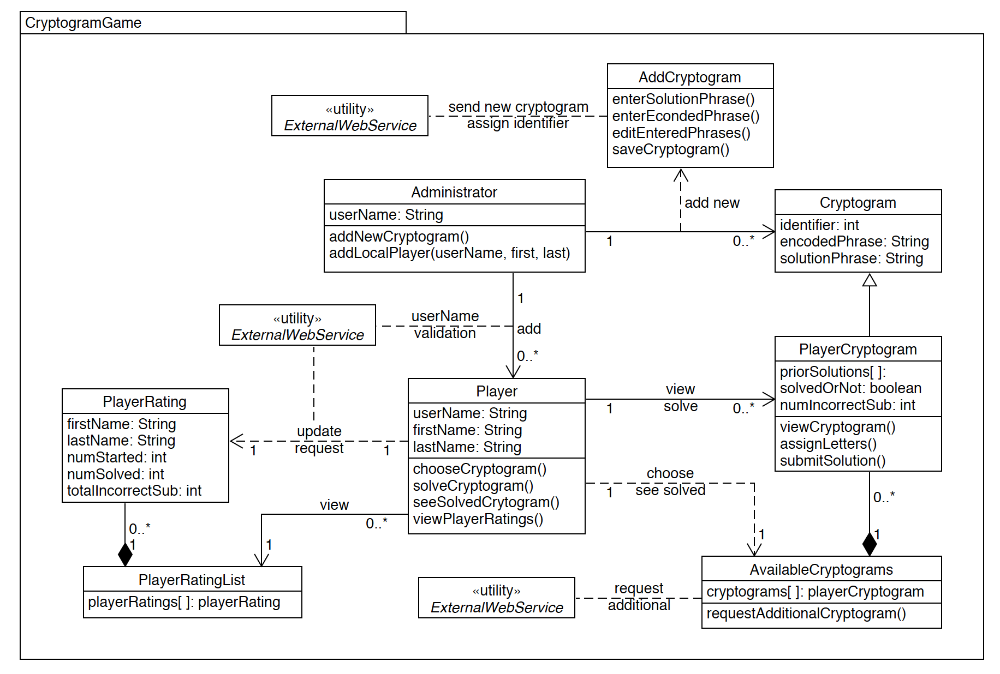
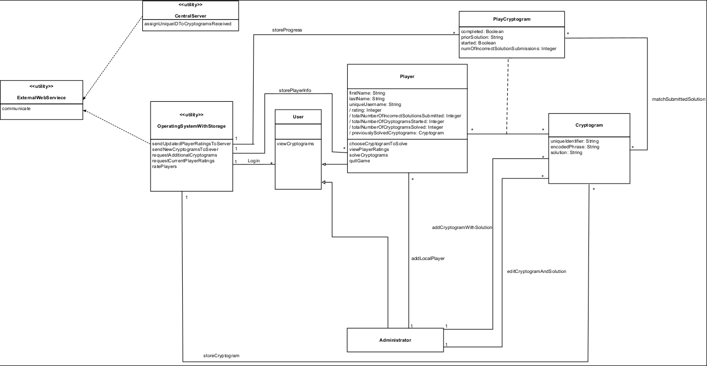
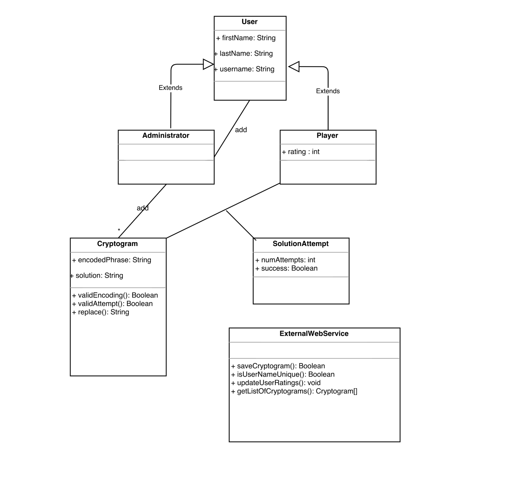

# Individual Designs

## Design 1 (xliang70)

There are several good aspects in this design.

The UML diagram is very simple and concise capturing the requirements in detail. It shows the relationships between the entities as specified by the requirements in a detailed manner. Every attribute that has been mentioned in the requirement has been added at the appropriate entity, so that the solution can be implemented without any gaps.

Here are some of the improvements that can be made:

Classes can be created in a hierarchical manner if it can be abstracted out into a common class. Distinct classes can be used for User, player and administrator. A cryptogram can be solved by all players, and this data needs to be captured for every player. Association classes has to be used to capture this data. 

Even though, there are minor enhancements that can be made, this is a very good design.

## Design 2 (lfan42)

**Pros:**
On the whole, it is a very straightforward and precise design. It covers almost every requirement(attribute and operation) from the instructions. The relationships between classes make good sense. The quantitative relations between classes are also described clearly.

**Cons:**
There are also some improvements can be made. First, Duplicate *ExternalWebService* can be reduced to one instance. Secondly, an extra utility class *CentralServer* can be used to assign identifiers to cryptograms, keeping the responsibility of *ExternalWebService* simple. Likewise, a *LocalServer* can be store local data and used for user rankings calculation. Besides, similar to the Library System in lecture video, *PlayerCryptogram* can be an association class.

## Design 3 (ychai37)

**Pros:**

It is a great design which shows almost all the requirements of the game clearly and precicesly. The most brilliant part is that the `OperatingSystemWithStorage` and the `CentralServer` utilities are added to fully present the working flows between the local game and the center server. Together with the `ExternalWebService`, the processes of both the adding/request of cryptograms and the update/request of player ratings are clearly illustrated.

**Cons:**
First the player rating list should be sorted by the `totalNumberOfCryptogramsSolved` attribute per the requirements, not the `rating` attribute. The latter is a derived attribute, however the designer didn't explain how it is derived from other attributes. Second the `PlayerCryptogram` class might be inherited from the `Cryptogram` class as an unique id is required for it.

## Design 4 (bkothandam3)

**Pros:**
The strtucture of this UML diagram is clear and you can understand each part quickly and easily. It covers all the required section and their relationships. Since its elegant and concise structure, it can be implemented painless and straightforward by the developers. 

**Cons:**
The first thing should be point out is the class *ExternalWebService* cannot be isolated with other classes. Some relationship between this class and others should be marked and detailed in the UML. Secondly, some methodes should be detailed, such as *choose a cryptogram to solve*, *see previously solved cryptograms*, and *view the list of player ratings*
# Team Design

# Summary

The team members were chosen at random from different time-zones around the globe. The team was agile in coming up with a time that worked for everyone and was able to collaborate on the final design. After discussing the pros and cons of every design, we pulled the best of each and assembled them together to form the team design.

By critiquing each other design, we were able to learn on the defects in our design. By working and brainstorming together and revisiting the examples, we were able to learn several aspects like: 
- a. understand the way the association class can be used. 
- b. how to apply the derived member variables appropriately.
- c. appropriate usage of the utilty classes.

All the members were able to contribute and learn from others. Overall, it was a good learning experience, setting up the stage to work on the future deliverables that will be assigned.
